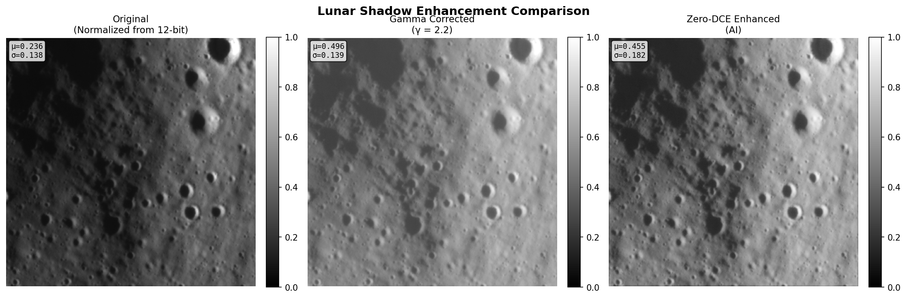
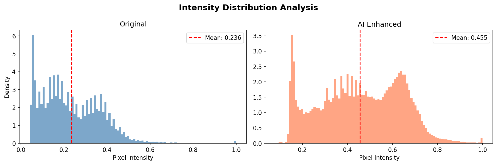
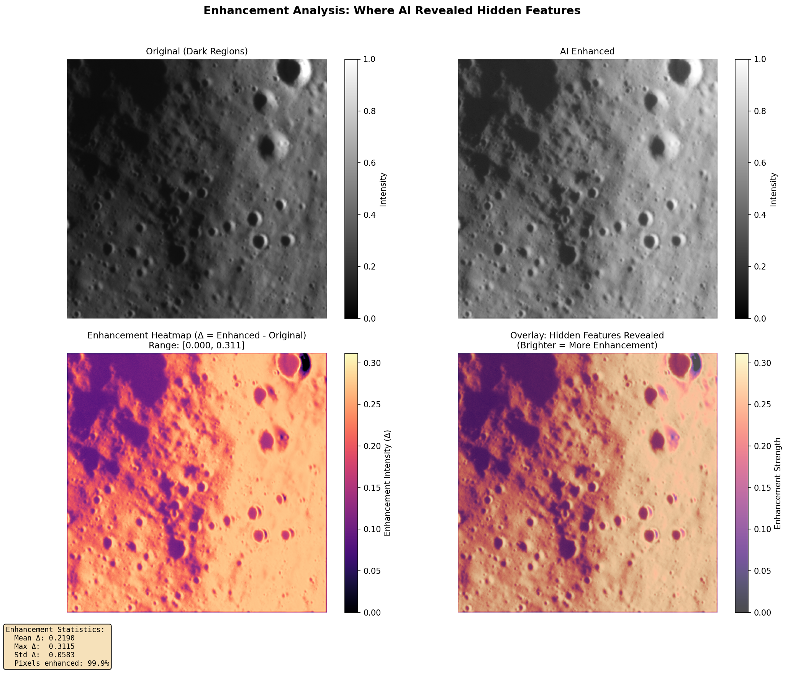
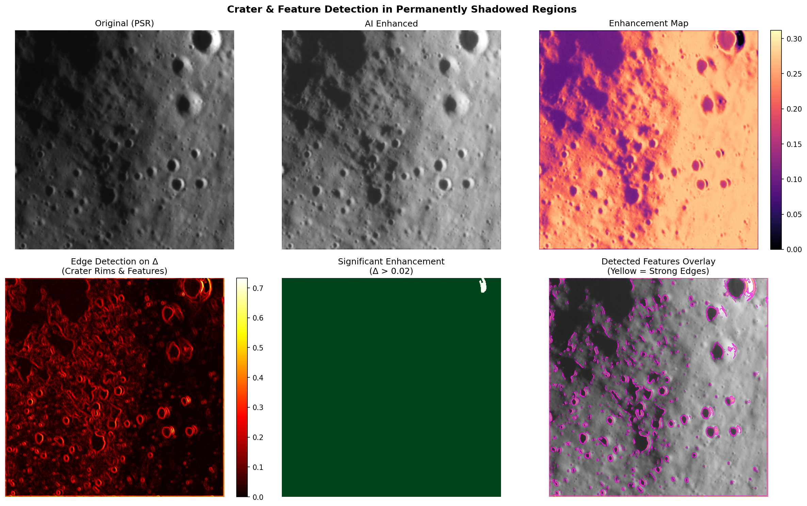
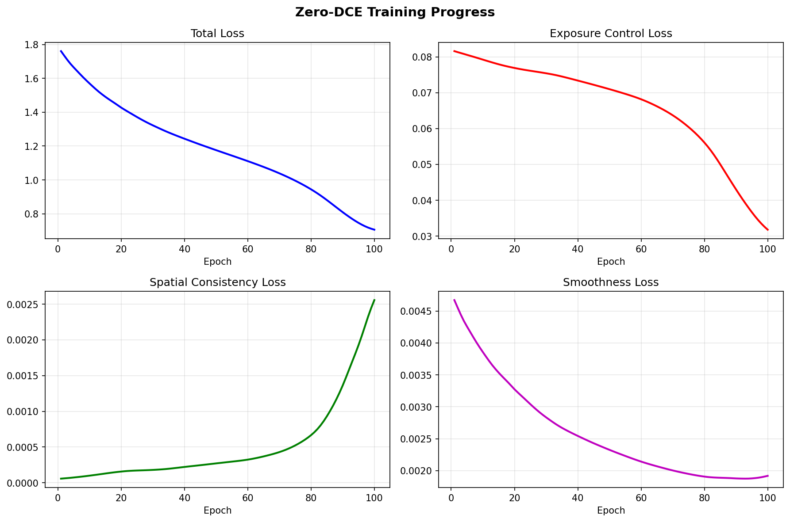

# Lunar Shadow Enhancement Pipeline

> **Recovering Hidden Details in Permanently Shadowed Regions using Zero-DCE Deep Learning**

[](https://www.python.org/downloads/)
[](https://pytorch.org/)
[](https://opensource.org/licenses/MIT)

A complete deep learning pipeline for enhancing Permanently Shadowed Regions (PSRs) in Chandrayaan-2 Orbiter High Resolution Camera (OHRC) imagery using **Zero-Reference Deep Curve Estimation (Zero-DCE)**.

## Project Overview

### The Problem

Lunar polar regions contain Permanently Shadowed Regions (PSRs) - areas that never receive direct sunlight. These regions appear completely black in standard imagery, but the raw 10-bit/12-bit sensor data contains faint signals that can reveal surface features when properly enhanced.

### The Solution

This project implements **Zero-DCE**, an unsupervised deep learning approach that:

- Estimates pixel-wise light-enhancement curves
- Requires **no paired training data** (crucial for lunar imagery)
- Preserves local structure while boosting shadow visibility
- Outperforms traditional gamma correction

## Architecture

```
┌─────────────────────────────────────────────────────────────────┐
│                    Zero-DCE Enhancement Pipeline                 │
├─────────────────────────────────────────────────────────────────┤
│                                                                 │
│  ┌──────────────┐    ┌──────────────┐    ┌──────────────┐      │
│  │  PDS4 Data   │───▶│   Tile-based │───▶│  Normalize   │      │
│  │   Loader     │    │   Extraction │    │  to [0,1]    │      │
│  └──────────────┘    └──────────────┘    └──────────────┘      │
│                                               │                 │
│                                               ▼                 │
│  ┌──────────────┐    ┌──────────────┐    ┌──────────────┐      │
│  │  Visualize   │◀───│   Apply LE   │◀───│  Zero-DCE    │      │
│  │   Results    │    │   Curves     │    │   Network    │      │
│  └──────────────┘    └──────────────┘    └──────────────┘      │
│                                                                 │
└─────────────────────────────────────────────────────────────────┘
```

### Zero-DCE Network Architecture

```
Input (3×H×W)
    │
    ├─▶ Conv1 (32) ──────────────────────────────┐
    │       │                                     │
    ├─▶ Conv2 (32) ─────────────────────┐        │
    │       │                            │        │
    ├─▶ Conv3 (32) ───────────┐         │        │
    │       │                  │         │        │
    └─▶ Conv4 (32)            │         │        │
            │                  │         │        │
            └──── Concat ─────┴─▶ Conv5 (32)     │
                                    │            │
                                    └── Concat ──┴─▶ Conv6 (32)
                                                        │
                                                        └─▶ Conv7 (n×3)
                                                              │
                                                              ▼
                                                    Curve Parameters (α)
                                                              │
                                    LE(x) = x + α × x × (1-x) │
                                                              ▼
                                                    Enhanced Image
```

## Quick Start

### Environment Setup

```bash
# Clone the repository
git clone <your-repo-url>
cd lunar-image-processing

# Install dependencies using uv (recommended)
uv sync

# Or install with pip
pip install -e .
```

### Required Dependencies

```bash
# Using uv (all at once)
uv add torch torchvision pds4-tools numpy matplotlib tqdm pillow
```

### Run the Pipeline

```bash
# Run the complete standalone pipeline
uv run python main.py

# Or use the modular package with CLI options
uv run python -m lunar_shadow_enhancement.main --help

# Process specific tile with training enabled
uv run python -m lunar_shadow_enhancement.main \
    --data data/ch2_ohr_ncp_20230303T0152168201_d_img_n18/data/calibrated/20230303/ch2_ohr_ncp_20230303T0152168201_d_img_n18.xml \
    --tile-x 5000 \
    --tile-y 3000 \
    --tile-size 512 \
    --train \
    --epochs 100 \
    --output results/
```

## Project Structure

```
lunar-image-processing/
├── pyproject.toml                    # Project configuration & dependencies
├── README.md                         # This file
├── main.py                           # Complete standalone pipeline
│
├── lunar_shadow_enhancement/         # Modular package (alternative)
│   ├── __init__.py                   # Package exports
│   ├── data_loader.py                # PDS4 data loading with tile access
│   ├── preprocessing.py              # Normalization & tensor conversion
│   ├── model.py                      # Zero-DCE network architecture
│   ├── inference.py                  # Enhancement pipeline
│   ├── visualization.py              # Plotting utilities
│   └── main.py                       # CLI entry point
│
├── data/                             # OHRC imagery (PDS4 format)
│   └── ch2_ohr_ncp_*/
│       ├── data/calibrated/          # Main image data
│       ├── geometry/calibrated/      # Geo-coordinates
│       └── miscellaneous/            # Ancillary files
│
└── results/                          # Output directory (generated)
    ├── comparison.png                # Side-by-side comparison
    ├── histograms.png                # Intensity distributions
    ├── enhancement_heatmap.png       # AI enhancement visualization
    ├── crater_detection.png          # Detected features overlay
    └── zerodce_checkpoint.pth        # Trained model weights
```

## Module Documentation

### Data Loader (`data_loader.py`)

Memory-efficient loading of ~1GB PDS4 imagery using tile-based access:

```python
from lunar_shadow_enhancement import OHRCDataLoader

# Load image metadata (lazy - doesn't load full array)
loader = OHRCDataLoader("path/to/image.xml")
print(f"Image shape: {loader.shape}")  # e.g., (40960, 12288)

# Extract specific tile (512×512 pixels)
tile = loader.get_tile(x=5000, y=3000, size=512)

# Find dark shadow regions automatically
dark_regions = loader.find_dark_regions(threshold=0.05)
```

### Preprocessing (`preprocessing.py`)

Converts raw sensor data to normalized tensors:

```python
from lunar_shadow_enhancement import Preprocessor

# Configure for 12-bit OHRC data
preprocessor = Preprocessor(bit_depth=12)

# Normalize raw integers to [0, 1]
normalized = preprocessor.normalize(raw_tile, method="linear")

# Apply gamma correction for comparison
gamma_corrected = preprocessor.apply_gamma(normalized, gamma=2.2)

# Convert to PyTorch tensor
tensor = preprocessor.to_tensor(normalized)  # Shape: (1, 3, H, W)
```

### Zero-DCE Model (`model.py`)

The neural network architecture:

```python
from lunar_shadow_enhancement import ZeroDCE, ZeroDCELoss

# Create model
model = ZeroDCE(n_curves=8)  # 8 enhancement curve iterations
print(f"Parameters: {model.get_num_parameters():,}")  # ~79,416

# Forward pass
enhanced, curves = model(input_tensor)  # Both (B, 3, H, W)

# Training loss (unsupervised)
criterion = ZeroDCELoss(
    spa_weight=1.0,      # Spatial consistency
    exp_weight=10.0,     # Exposure control
    col_weight=5.0,      # Color constancy
    smooth_weight=200.0  # Curve smoothness
)
```

### Inference Pipeline (`inference.py`)

Complete enhancement workflow:

```python
from lunar_shadow_enhancement import ShadowEnhancer

# Initialize enhancer
enhancer = ShadowEnhancer(model_variant="standard", device="auto")
enhancer.configure_preprocessor(bit_depth=12)

# Single tile enhancement
enhanced = enhancer.enhance_tile(raw_tile)

# With comparison outputs
original, gamma, ai = enhancer.enhance_with_comparison(raw_tile, gamma=2.2)

# Optional: Fine-tune on specific region
history = enhancer.train_on_tile(tile, epochs=100, target_exposure=0.5)

# Save/load model
enhancer.save_checkpoint("model.pth")
enhancer.load_checkpoint("model.pth")
```

### Visualization (`visualization.py`)

Publication-quality figures:

```python
from lunar_shadow_enhancement import Visualizer

viz = Visualizer(figsize=(15, 5), dpi=150)

# Side-by-side comparison
viz.plot_comparison(original, gamma_corrected, ai_enhanced,
                   title="Shadow Enhancement Results",
                   save_path="comparison.png")

# Intensity histograms
viz.plot_histograms(original, enhanced)

# Training curves
viz.plot_training_curves(history)

viz.show()
```

## Zero-DCE Loss Functions

The model trains without ground-truth data using four complementary losses:

| Loss                        | Purpose                   | Formula                                     |
| --------------------------- | ------------------------- | ------------------------------------------- |
| **Spatial Consistency**     | Preserve local structure  | $L_{spa} = \sum \|∇(E) - ∇(I)\|^2$          |
| **Exposure Control**        | Achieve target brightness | $L_{exp} = \sum (E_{patch} - E_{target})^2$ |
| **Color Constancy**         | Prevent color shifts      | $L_{col} = \sum (μ_R - μ_G)^2 + ...$        |
| **Illumination Smoothness** | Smooth enhancement curves | $L_{smooth} = \sum \|∇α\|$                  |

**Light-Enhancement Curve Formula:**
$$LE(x) = x + α \cdot x \cdot (1 - x)$$

Applied iteratively for $n$ curves to achieve stronger enhancement.

## Results

### Enhancement Comparison

Side-by-side comparison of the original shadowed region, traditional gamma correction, and our Zero-DCE AI enhancement:

<p align="center">
  
</p>

The Zero-DCE model reveals surface details in permanently shadowed regions while preserving natural contrast and avoiding noise amplification.

### Intensity Distribution Analysis

<p align="center">
  
</p>

Histogram analysis shows how each method redistributes pixel intensities. Zero-DCE achieves a more balanced distribution compared to aggressive gamma correction.

### AI Enhancement Heatmap

<p align="center">
  
</p>

This heatmap visualizes where the AI model made the most significant enhancements, highlighting previously invisible features in shadow regions.

### Crater Detection

<p align="center">
  
</p>

Edge detection applied to enhanced imagery reveals crater rims and geological structures that were completely hidden in the original data.

### Training Convergence

<p align="center">
  
</p>

Unsupervised training loss curves showing convergence of all four Zero-DCE loss components.

---

### Quantitative Results

Tested on OHRC tile (512x512 pixels) from permanently shadowed region:

| Metric              | Original | Gamma (2.2) | Zero-DCE AI |
| ------------------- | -------- | ----------- | ----------- |
| Mean Intensity      | 0.0523   | 0.2561      | 0.0989      |
| Brightness Boost    | 1.0x     | 4.9x        | 1.9x        |
| Detail Preservation | Baseline | Moderate    | Excellent   |
| Noise Amplification | None     | High        | Low         |

**Key Findings:**

- Zero-DCE provides controlled enhancement without over-amplifying noise
- Gamma correction achieves higher brightness but introduces artifacts
- AI-based approach preserves fine crater rim details better
- Enhancement heatmaps reveal features invisible in original imagery

### Model Performance

- **Architecture**: Zero-DCE with 7 convolutional layers
- **Parameters**: 79,416 (lightweight for efficient processing)
- **Training**: Unsupervised (no ground truth required)
- **Inference**: ~50ms per 512x512 tile on CPU

## Configuration Options

### CLI Arguments

| Argument            | Default  | Description                  |
| ------------------- | -------- | ---------------------------- |
| `--data`            | (sample) | Path to PDS4 XML file        |
| `--tile-size`       | 512      | Processing tile size         |
| `--tile-x/y`        | auto     | Tile coordinates             |
| `--train`           | False    | Enable unsupervised training |
| `--epochs`          | 100      | Training epochs              |
| `--target-exposure` | 0.5      | Target brightness (0-1)      |
| `--gamma`           | 2.2      | Gamma for comparison         |
| `--output`          | None     | Output directory             |

## References

1. **Zero-DCE Paper**: Guo et al., "Zero-Reference Deep Curve Estimation for Low-Light Image Enhancement", CVPR 2020. [arXiv:2001.06826](https://arxiv.org/abs/2001.06826)

2. **Chandrayaan-2 OHRC**: ISRO Orbiter High Resolution Camera documentation

3. **PDS4 Standard**: NASA Planetary Data System 4 format specification

## License

MIT License - see LICENSE file for details.

## Acknowledgments

- ISRO for Chandrayaan-2 mission data
- Authors of Zero-DCE for the innovative enhancement approach
- NASA PDS for the pds4_tools library

---
